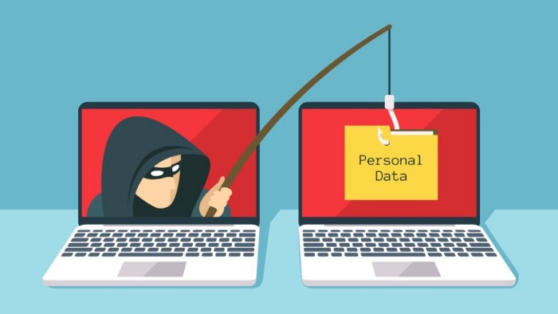
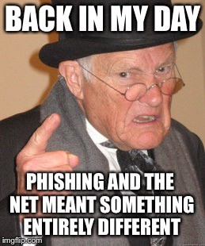
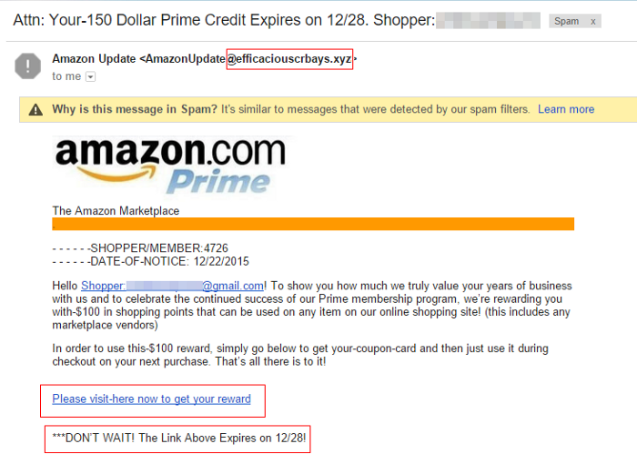
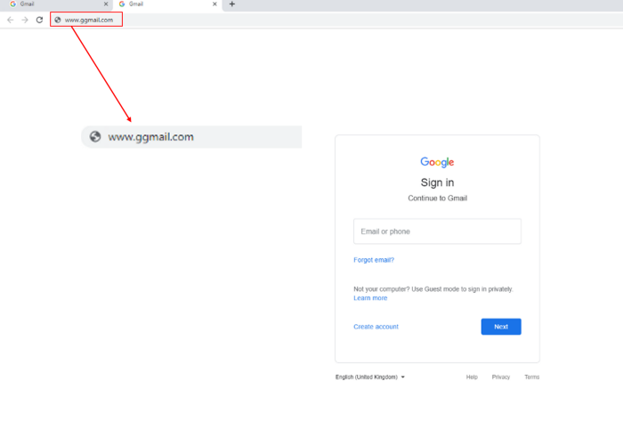

It is one of the biggest cybersecurity threats of 2019. “Phishing” is the technical term for the act of conning someone online in order to steal their confidential and sensitive information. I would rather call it E-conning so as to simply state what it really is.If something sounds too good to be true… there’s probably a scammer behind it.

## So what it is?
Phishing in general means to copy a website or email and act as an authenticated person in order to trick the victim into revealing sensitive information. Such attacks can lead to damaging losses in terms of identity theft,sensitive intellectual property and customer information, and national-security secrets.
Phishers always take advantage of human nature that generally ignores critical warning messages. Lack of awareness about the phishing attacks in the society is also the main reason why phishing attacks have been so much successful. Whenever any researcher came with some technique to prevent these attacks, phishers try to find out associated loophole to commit successful attacks.

## What damage can they do?

* Theft of login credentials: Phisher steals login credentials of online services like eBay, Amazon and Gmail from the user using spoofed email as warning message to change password and provided hyperlink.
* Theft of banking credentials: Online login credentials and credit card details such as card number, expiry and issue dates, cardholder’s name, CCV number and several other popular banking organizations like PayPal, OnlineSBI, HDFC and Citibank.
* Capture of personal information: Personal information, such as address and telephone number, is highly saleable and in constant demand by direct marketing companies.
* Theft of trade secrets and confidential documents: With spear phishing techniques, phishers are targeting specific organizations for acquisition of proprietary information and used directly or sold to interested parties.
* Fame and notoriety: A very interesting psychological aspect of phishing in which information is phished not for financial gain but carried out mainly to gain recognition and notoriety among their peers.
* Exploit security holes: People who are curious to find out how robust a particular system is may try to write programs to break somebody else’s system to launch phishing attacks or to sell the compromised systems to other phishers.

## How does a bad guy actually do it?

### Stage 1: Planning and setup
In the first step, the attackers identify the target organization or individual or a nation. Then, their task is to get details about the organization and its network. It can be done by visiting the place physically or monitor the traffic going in and out of the network. The next step is to set up the attacks by using a feasible means, e.g., website or emails having malicious links, which may redirect the victim to some fraud web page.

### Stage 2: Phishing(it is as similar to fishing as it sounds)
The next step is to send these spoofed emails or links, e.g., masqueraded as some reputed banking organization to the victim using the collected email addresses, which ask user to update some information urgently by clicking on some malicious link. The emails might be sent to individuals or specific person in an organization. Basically, they send out such malicious links and wait for the fish to get caught.

### Stage 3: Break-in/infiltration
As soon as the victim(fish) opens the fraud link, either a malware is installed on the system which allows the attacker to intrude the system and change its configuration or access rights are changed accordingly. In other cases, it might lead to some fake page that asks for credentials.

### Stage 4:Data collection
Once the attackers get access to the user’s system, the required data are extracted, and if the user gives his account details to the attacker, they can now access his/her account, and this may lead to financial losses to the victim. In case of malware attacks, now the attacker may get remote access to the system and get the data he/she wants whatsoever, or the compromised systems could be used for DDoS attacks, etc.

### Stage 5: Break-out/exfiltration
After getting the required information, the phisher now removes all the evidences, i.e., the false websites accounts. It is also observed that they track the degree of success of their attack for refining future attacks.

## How to stay safe?

Always pay attention to the sender email and the URL of the links in the email. These provide you with enough indications of the authenticity of the email.

This webpage looks exactly the same as of the real Gmail sign in page. But as you can observe that the URL is the not the actual one. So look closely!! Hackers can easily replicate the websites so you should check the URL always.
One can also opt for extensions like the PhishDetector for Google Chrome in order to stay safe from all kinds of phishing.
Organizations can also opt for filtering methods for emails,links on the computers on their network:
* Email Filtering
* URL-Filters
* Script Filters
* Sender Based Filters
The filtering softwares are not very efficient and only cater to a certain previously known data set of emails/websites. The method of user training cannot guarantee prevention of phishing attacks. Overall, there is no fool-proof way to deal with phishing attacks.

## Present Scenario
Phishing attacks are now becoming pervasive and sophisticated. Phishing has spread beyond email to include VOIP, SMS, instant messaging, social networking sites, and even massively multiplayer games.Criminals have also shifted from sending mass-email messages, hoping to trick anyone, to more selective “spear-phishing” attacks that use relevant contextual information to trick specific victims.
The latest trend is phishing using Chatbots. According to a survey, users trust chatbots more than people online possibly as they think the bot is programmed.However, hackers have been found to change the code of the chatbot thus asking the user for sensitive info. Evidently, users give such details to chatbots and become phishing victims.

IoT(Internet of Things) devices are also becoming a victim of phishing due to their increasing popularity.IoT is a very fast evolving architecture these days connecting every day-to-day object making our lives more comfortable. Yes i am talking about all the SMART things in your house — Smart TV, Smart Refrigerator, Smart Plugs and whatever else you have. 😜But, due to limited resources available to the IoT devices, their security mechanism is close to absent which makes them a very easy target for the attackers. IoT devices are sent malware which spreads like botnets and the devices have to be taken offline and cleaned of malware.
So don’t be quick to click! Ciao!

Image credit: [Imgflip](https://imgflip.com/),[Komando](http://komando.com/),[HeimdalSecurity](http://heimdalsecurity.com/)