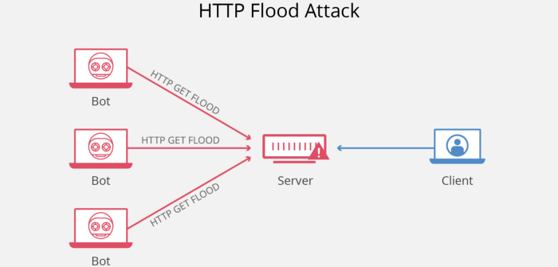

Distributed Denial of Service(DDoS) Attacks have thronged the World Wide Web for the past 15 years. Even today we encounter websites that are “down” a.k.a unavailable and the reason for that more often than not are DDoS attacks. Even though the principle of these have remained the same, we still don’t have a fool proof way of preventing them. Not beating about the bush, let me throw light as to what they actually are and why they are still a cyber security challenge.

## What it is?

A denial-of-service(DOS) attack is where hackers render a site inaccessible to legitimate customers. Hackers do this by overwhelming the website with traffic and data until the website crashes. Although denial-of-service attacks do not have a direct financial cost to the victims, the indirect cost of lost sales can be high not to mention the frustration of getting the website up and running again.
E-commerce websites are the most likely targets of denial-of-service attacks. That said, hackers have been known to go after different types of high-profile businesses including media agencies and government organizations.
Besides keeping your anti-virus software and security patches up-to-date, you should also be monitoring your traffic reports to protect against a denial-of-service attack. A sudden increase in traffic or other strange traffic patterns could be an early sign of this type of attack.
A distributed denial of service attack (DDoS) is a special type of denial of service attack. The principle is the same, but the malicious traffic is generated from multiple sources — although orchestrated from one central point. The fact that the traffic sources are distributed — often throughout the world — makes a DDoS attack much harder to block than one originating from a single IP address.

## Motivation behind DDoS attacks

The trend of DDoS attacks is towards shorter attack duration, but bigger packet-per-second attack volume.
Attackers are primarily motivated by:

* Rebellion— DDoS attacks as a means of targeting websites hackers disagree with ideologically.
* Business rivalry— Businesses can use DDoS attacks on their rivals to gain the customers of the other.
* Fun—Script-kiddies use pre-written scripts or softwre to launch DDoS attacks. The perpetrators of these attacks are typically bored.
* Cyber warfare — Countries these days have engaged in Cyber Warfare. Most of us are unaware of such events as they happen quietly on the Dark Web. Government authorized DDoS attacks are an example of the latter

## Taxonomy:

* Volume Based Attacks 
Includes UDP floods, ICMP floods, and other spoofed-packet floods. The attack’s goal is to saturate the bandwidth of the attacked site, and magnitude is measured in bits per second (Bps).
* Protocol Attacks 
Includes SYN floods, fragmented packet attacks, Ping of Death, Smurf DDoS and more. This type of attack consumes actual server resources, or those of intermediate communication equipment, such as firewalls and load balancers, and is measured in packets per second (Pps).
* Application Layer Attacks 
Includes low-and-slow attacks, GET/POST floods, attacks that target Apache, Windows or OpenBSD vulnerabilities and more. Comprised of seemingly legitimate and innocent requests, the goal of these attacks is to crash the web server, and the magnitude is measured in Requests per second (Rps).

## Where do we stand?
DDoS attacks are becoming increasingly commonplace, according to research published by Corero Network Security at the end of 2017. Its DDoS Trends and Analysis report found that the number of attacks increased by 35% between Q2 2017 and Q3 2017.

One reason for their increased prevalence is the increasing number of insecure Internet of Things (IoT) devices that are being infected and recruited into botnets such as Reaper.
The volume of data launched at DDoS attack victims has also gone up significantly, largely thanks to amplification attacks such as the memcached amplification attack technique. Earlier this year, cyber-criminals launched some 15,000 memcached attacks, including an attack on GitHub that maxed out at an astonishing 1.35 Tbps(Tera Bits per second).
There is no cure that fits all. There is no single fool proof method that can prevent or even stop a ddos attack due to the variety of the latter. So what do we do for such a disease?
We Vaccinate

## How to Build Resistance

1. Buy more bandwidth(than you might ever need)
Of all the ways to prevent DDoS attacks, the most basic step you can take to make your infrastructure “DDoS resistant” is to ensure that you have enough bandwidth to handle spikes in traffic that may be caused by malicious activity.
In the past it was possible to avoid DDoS attacks by ensuring that you had more bandwidth at your disposal than any attacker was likely to have. But with the rise of amplification attacks, this is no longer practical. Instead, buying more bandwidth now raises the bar which attackers have to overcome before they can launch a successful DDoS attack, but by itself, purchasing more bandwidth is not a DDoS attack solution.
Even if you bought extra 100 percent — or 500 percent — that likely won’t stop a DDoS attack. But it may give you a few extra minutes to act before your resources are overwhelmed completely. So we go from seconds to disaster to minutes to stopping the disaster.

2. Build redundancy into your infrastructure
To make it as hard as possible for an attacker to successfully launch a DDoS attack against your servers, make sure you spread them across multiple data centers with a good load balancing system to distribute traffic between them. If possible, these data centers should be in different countries, or at least in different regions of the same country.
For this strategy to be truly effective, it’s necessary to ensure that the data centers are connected to different networks and that there are no obvious network bottlenecks or single points of failure on these networks.
Distributing your severs geographically and topographically will make it hard for an attacker to successfully attack more than a portion of your servers, leaving other servers unaffected and capable of taking on at least some of the extra traffic that the affected servers would normally handle.

3. Configure your network hardware against DDoS attacks
There are a number of simple hardware configuration changes you can take to help prevent a DDoS attack.
For example, configuring your firewall or router to drop incoming ICMP packets or block DNS responses from outside your network (by blocking UDP port 53) can help prevent certain DNS and ping-based volumetric attacks.

4. Deploy Anti-DDoS software modules
Your servers should be protected by network firewalls and more specialized web application firewalls, and you should probably use load balancers as well.Amazon Web Services provide load balancers to websites hosted on their server(EC2)

5. Protect your DNS servers
Don’t forget that a malicious actor may be able to bring your web servers offline by DDoSing your DNS servers. For that reason it is important that your DNS servers have redundancy, and placing them in different data centers behind load balancers is also a good idea. A better solution may even be to move to a cloud-based DNS provider that can offer high bandwidth and multiple points-of-presence in data centers around the world. These services are specifically designed with DDoS prevention in mind.
However……
Preventing a DDoS attack when malicious actors can launch over 1 Tbps at your servers is almost impossible, and that means that it is more than important than ever to understand how to stop a DDoS attack after it has started to affect your operations. Here are some tips for when you are under such an attack.

1. Identify the DDoS attack early
The detection phase requires analysis of the running system to discover malicious traffic that leads to a DDoS attack. Detection involves a sophisticated approach to identify large unexpected traffic against a web server. Most of the detection techniques were applied to form DDoS detection known as pattern matching, clustering, statistical methods, deviation analysis, associations, and correlation. Formation of detection usually employs data history as the main source to train the data to generate a threshold which will be assigned to a parameter via a specific method to count the GET request received.
If you run your own servers, then you need to be able to identify when you are under attack. That’s because the sooner you can establish that problems with your website are due to a DDoS attack, the sooner you can stop the DDoS attack.

2. Call your ISP or hosting provider
The next step is to call your ISP (or hosting provider if you do not host your own Web server), tell them you are under attack, and ask for help. Keep emergency contacts for your ISP or hosting provider readily available so you can do this quickly. Depending on the strength of the attack, the ISP or hoster may already have detected it — or they may themselves start to be overwhelmed by the attack.
You stand a better chance of withstanding a DDoS attack if your Web server is located in a hosting center than if you run it yourself. That’s because its data center will likely have far higher bandwidth links and higher capacity routers than your company has, and its staff will probably have more experience dealing with attacks. Having your Web server located with a hoster will also keep DDoS traffic aimed at your Web server off your corporate LAN so at least that part of your business — including email and possibly voice over IP (VoIP) services — should operate normally during an attack.
“It can be very costly for a hosting company to allow a DDoS onto their network because it consumes a lot of bandwidth and can affect other customers, so the first thing we might do is black hole you for a while,” said Liam Enticknap, a network operations engineer at PEER 1 hosting.
Tim Pat Dufficy, managing director of ISP and hosting company ServerSpace, agreed. “The first thing we do when we see a customer under attack is log onto our routers and stop the traffic getting onto our network,” he says. “That takes about two minutes to propagate globally using BGP (border gateway protocol) and then traffic falls off.”
If that was the end of the story, the DDoS attack would still be successful. To get the website back online, your ISP or hosting company may divert traffic to a “scrubber,” where the malicious packets can be removed before the legitimate ones are be sent on to your Web server.

3. Create a DDoS playbook
The best way to ensure that your organization reacts as quickly and effectively as possible to stop a DDoS attack is to create a playbook that documents in detail every step of a pre-planned response when an attack is detected.
This should include the actions detailed above, with contact names and telephone numbers of all those who may need to be brought into action as part of the playbook’s plan. DDoS mitigation companies can help with this by running a simulated DDoS attack, enabling you to develop and refine a rapid corporate procedure for reacting to a real attack.
An important part of your planned response to a DDoS attack that should not be overlooked is how you communicate the problem to customers. DDoS attacks can last as long as 24 hours, and good communication can ensure that the cost to your business is minimized while you remain under attack.  
As of now there isn’t any silver bullet for DDoS attacks, the quest goes on!!

Image credit: [Ebuyer](http://www.ebuyer.com/),[Cloudfare](https://www.cloudflare.com/)