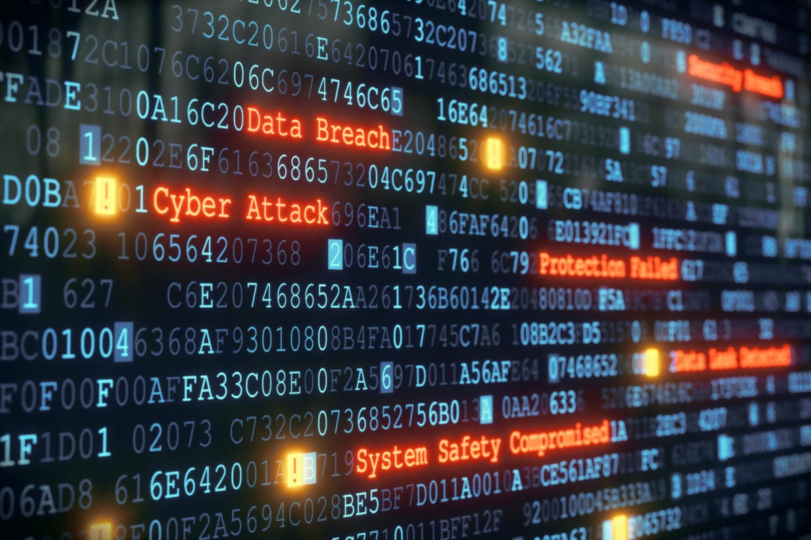

Cyber Attacks are exponentially increasing by the day. The omnipresence of Internet enabled devices around us makes such attacks terrorizing for us. Thus, to resist such threats, it is essential to develop mechanisms and protect our devices and networks. There are mainly two ways to go about it, either we build countermeasures against attacks or either we implement hardening of devices and connection methods. How should we go about it?
Lets discuss…….

## Hardening
Hardening one of the most important components of system security. It is a method of securing devices/networks by minimizing the area exposed to the public. This makes sure that there are less vulnerabilities out in the open. This is done largely by removing unnecessary software, hardening default credentials, disabling unnecessary services, and modifying other configuration parameters from default values so that the system works securely for a focused set of services.
For networks and systems of the organisational and corporate level, the risk of security breach is high. Their systems are diverse and widely spread, hence, a hacker only needs to find one weak point in the plethora of connected devices to get into the network and he is really spoilt for choice! On the contrary, smaller networks such as home networks are relatively more secure as they have less areas of susceptibility. 

No matter whichever new system is setup, the hardening process is critical to establish a baseline of system security, especially for an organization. Moreover, when a new system is bought, it comes pre-installed with a number of software, applications, services, drivers, features, and even bloatware. All these are points at which the security fence is weak and can be easily broken by hacker(s). It is, therefore, necessary to remove the unnecessary software and configure the necessary ones for additional security.

The actions that are normally taken when performing system hardening are:
* Disabling certain ports and stopping certain services
* Removing certain features of the operating system
* Uninstalling unnecessary and vulnerable software
* Changing default settings and removing features and applications not needed by your organization
* Ensuring each system’s security configurations are set properly
* Ensuring OS software, firmware, and applications are up to date
* Ensuring the system hardening process evolves constantly, with maximum automation and updating
* Testing during hardening of the systems to make sure anything critical to the organization is not impacted
* Updating the hardening to include new patches or software versions in the standard configuration, so the addition of a similar system in future does not come with the old weaknesses

## Countermeasures
The developers of operating system and software do not think much about the security aspect. This is understandable because they are developers and not cyber security specialists. Hackers often exploit the developers’ code itself and compromise the integrity, availability and confidentiality of the systems. Hence, it is essential to have countermeasures so as to make software and operating systems secure.
In cyber security, methods that provide security against vulnerability threats and cyber attack(s) are known as cyber crime countermeasures. Antiviruses and Firewalls are the most common methods of providing cyber attack countermeasures. The companies that provide these, scan the internet for new malware and also perform vulnerability testing on the systems they are made to protect. This is done on a regular basis as they have to keep updating the operating systems for patching the bugs and release anti-malware methods. 
There are mainly four basic types of countermeasures:
* Preventative — These work by keeping something from happening in the first place. Examples of this include: security awareness training, firewall, anti-virus, security guard and IPS.
* Reactive — Reactive countermeasures come into effect only after an event has already occurred.
* Detective — Examples of detective counter measures include: system monitoring, IDS, anti-virus, motion detectors and IPS.
* Administrative — These controls are the process of developing and ensuring compliance with policy and procedures. These use policy methods to protect an asset. 

So….whats the conclusion?  

Well, I would think of it as an analogy to the Marvel Comics. Hardening is Captain America and Countermeasures are like Iron Man. Lemme explain..  

* Captain America was made into a more powerful soldier, hence, if I may, his abilities were hardened. His physique completely changed while his core remained the same, just like hardening of protocols and software architecture.
* Tony Stark made a super suit to defend the world from outer space threats. He did not make any changes to himself for this, the suit was an outer protective cover as a countermeasure. 

Both of these heroes in cyber security are essential and one can’t really compare. However, it maybe better to have hardened protocols rather countermeasures. Still countermeasures are always going to be exist because when it comes to cyber security, one can’t be 100% sure. It is important to note that the implementation of both affects the quality of their purpose.

Image credit: [Infoguard Cybersecurity](http://www.infoguardsecurity.com/system-hardening-and-cyber-security/),[Techhive](https://images.techhive.com/images/article/2015/09/thinkstockphotos-479801072-100611728-large.jpg)