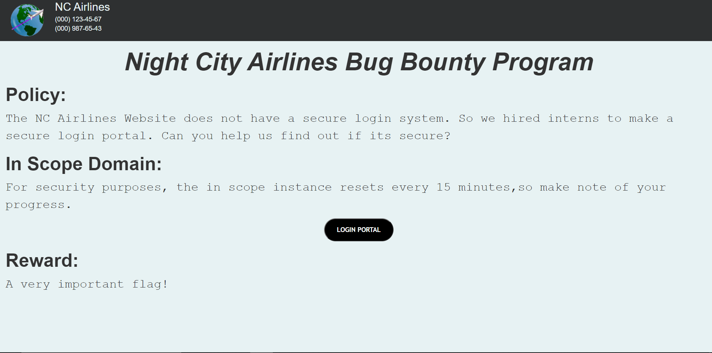

[Winja-logo](../images/winja/winja-logo.png)

I had developed two challenges for Winja CTF 2021, - Secretive Flights and NC-Bug-Bounty. NC-Bug-Bounty was not solved by any participant, so here goes the solution writeup for it.


## The landing page

The landing page of the challenge is similiar to any bug bounty's page. We are given an inscope domain and the story about the login portal being insecure is given to us.



## First Intern's Submission (Round 1)

Coming to the inscope domain, the first login portal is shown. After some basic enumeration you can understand that the credentials to login are neither in the web page's source code nor in any text file on the web directory. SQL Injection should strike your mind at this time. If it didn't, well, you will get it next time. And you are feel free to try out tools like SQLMap, which will probably fail, coz I tested them (Manual injection demon strikes :D) 

Lets assume the SQL query in the backend to be something like:

```sql
SELECT * from Users where username= '" + username + "' and password ='" + password + "'";
```

The basic SQL Injection payload for such a query can be found out if not known by a simple google search:

```sql
admin' or '1'='1
```

Hence, the query that runs in the backend becomes:

```sql
SELECT * from Users where username= 'admin' or '1'='1' and password ='" + password + "'";
```

Hence, even though you do not know the real credentials, you were able to bypass the login.

## Second Intern's Submission (Round 2)

It is pretty clear that the challenge is SQL Injection based, hence lets continue in that direction. Here, we are given a hint:

> This intern's work seems secret-ive. I guess he has his secrets on our database resources.

So we understand that there is a secret table on the same database which we need to access. After some hit and trial or after the hint during the contest, you can make out that the table name is "secret_table". Creating a union query so as to get the result from another table:

```sql
' union select secret from secret_table#
```
And it works! Even though you didn't get to know the secret, you bypassed the second round. Isn't that what matters? Right?.....Right?


## Third Intern's Submission (Round 3)

The hint for this round is:

> Even this girl seems secretive. However, she said all the SQL commands will be blanked in the inputs!

So the takeaway from this is that there is still a secret_table in the database and that any SQL command you inject will be blanked- meaning it will be removed. So how do we get around this?

What if, you make this filter a double-whammy. You create such a query on which upon nullifying the SQL commands, you get the right one? For example - 

```sql
' uniunionon selselectect secret from secret_table#
```

Pretty clever,right?

## Fourth Intern's Submission (Round 4)

This intern's information is:

> I don't know why are all these interns so secretive. This guy claims all the SQL commands will not be processed at all. He says he has considered both CASES.

Continuing on the still unknown secret, we now know that the SQL commands will not be processed. We can imply that if we include any SQL statements like SELECT or UNION, the input won't be processed. However, there must be a catch(afterall, its a CTF). The hint also mentions about "both CASES". Think, what has two cases?????

I hope you got it, incase you didn't, its the <strong>UPPER</strong> and <strong>LOWER</strong> case. So the intern didn't consider the <strong>mIxEd</strong> case. So the injection becomes:

```sql
' UNiON SElECT secret FrOm secret_table#
```

You might be thinking, how many interns did they hire?? I say you should have contacted Ramlal Kulkarni. (Only those who participated can get the joke,sorry for others)

## Fifth Intern's Submission (Round 5)

Let's just get to the hint now, If I were you I would really wanna see the secret

> I guess I should hire non-secretive interns. Still lets give the last one a try. She doesn't really like spaces tbh.

So the hint is clear and simple, there is still the secret table and this intern has found a way to block spaces? After all, who uses spaces in their username and password?

An interesting thing about SQL comments is that "/**/" gets parsed as a space. Let's use this to our advantage:

```sql
'/**/UNION/**/SELECT/**/secret/**/FROM/**/secret_table#
```

And you get the flag finally, 
> flag{nc-bug-bounty_t00k_y0u_l0ng_3n0ugh}

## End notes

There would be many different injections possible for the various rounds. Please, drop in the comments below what you came up with. Also, for people who are wondering if you could use the ASCII values to substitute SQL statements, you can do that in one of the rounds. In other rounds, I had blocked it so as to not make it the god query for the challenge.

Interpreting the hints correctly and appropriate google search about SQL Injection Payloads would have helped one to solve the challenge all the way through.You can find the source code on my [Github](https://github.com/codeFather-x/Winja-CTF-Challenges). Join the discord [server](https://discord.com/invite/AawhaQy) if you haven't already. You can ping any of the mods for challenge related questions and also if you want to join like minded people. If you want to dm me, feel free to do so. Peace✌. 