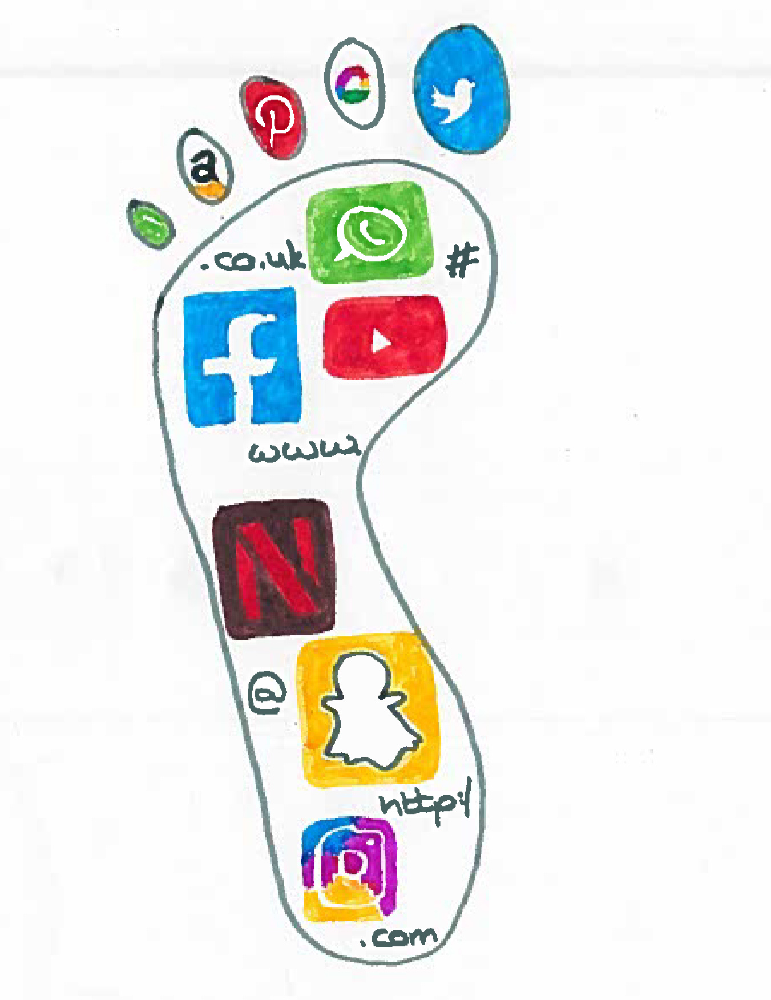
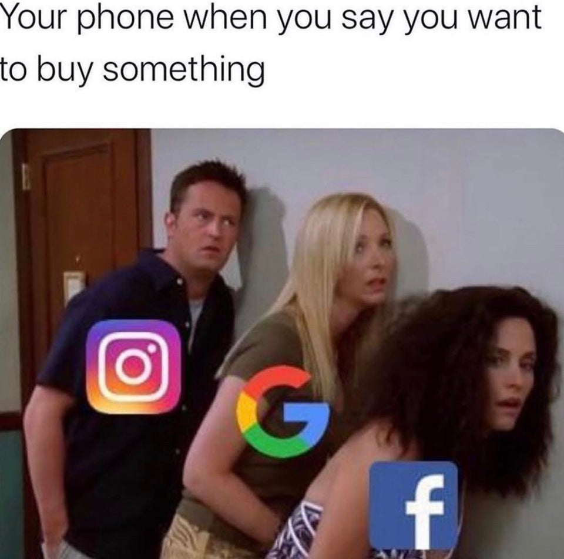
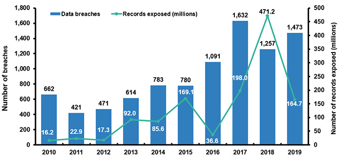

We interact with social media and various online services on a daily basis. People are getting scammed left and right. Data breach occurrences have skyrocketed over the past few years. Chances are, you may have already been hacked, atleast once. 

## Your Digital Footprint
All of our daily and regular tasks are online interactions. From sending important work communications to buying grocery and apparel, everything is available online. And with the virus impacting our lives immensely, we prefer online methods. Our entertainment is also online based, streaming services like Spotify, Youtube, OTT Platforms etc. Our social life has already been online for about a decade now. Rather, the question is what do we NOT do on the internet these days. Whatever you do leaves a "digital" footprint. Let me explain.

When you are shopping on an e-commerce website, something you buy is information for product companies, something you even put on your wishlist is also important data. This gives them an idea about what you use in your life and also what you even wish to have. And with the wide category of items online, over a period of time, they might know what you like better than even your own family (I am not joking). What posts you like on social media is data, what hashtags and people you follow is data about you. From the political leaders and influencers you follow and like, it implies the views they represent is what you agree with as well. Many of you might not know, wherever you go (if you don't have your settings right), your location/travel activity is logged in your phone. You go out for a family dinner, you post a picture on your social media timeline. Now, if you add a location while posting your picture, that also is information. This information helps one know about all your favourite restaurants. When you login into your Google account in your phone or browser, your search history is associated with your account and also stored. Suppose you search for a car repair shop near you, it implies your car requires repair. This information is valuable as well. The repair shop owners can use this info to find potential clients like you and offer you their services. In one perspective you are getting the services you are looking for but on the other hand your life is not private anymore. Online surveys are no different. Many corporate giants host surveys with rewards (even real money) for people to better get to know the market, its all about the information. It is all fine as long as it is anonymous, but when you get targeted marketing advertisements meaning whatever you do online gets associated with your online identity, people get to know more about you than you want them to know. In other words, privacy goes boom.

## Digital Scams

A few years ago we used to recieve scam emails and SMSes giving us free rewards or lucky draw winnings. The scammers have upped their game now and now use popular platforms that we trust (I shall not name any platforms as its not their fault). Many of us have become aware about digital scams as they have been common as of late, especially with the popular use of e-wallets and UPI based transaction methods. Many reselling platforms and e-payment portals are used and the less tech savvy are fooled with ease. Often the person on the other end of the call sounds so sophisticated in their language and tone that even educated people and even those working for financial institutions get fooled easily. However, the scams are not just limited to payment related apps or portals, its also our messaging services we use very day. Someone getting a hold of our email or social media or messaging account is just as dangerous as identity theft is a major issue these days. According to NortonLifeLock, nearly 330 million people across 10 countries were victims of cybercrime and more than 55 million people were victims of identity theft in 2020.

I have elaborated more on [phishing](./2019-05-13-phishing) (a.k.a digital scams) in another tech article, how its actually done and why it still is the most efficient way of stealing money and gaining unauthorised access. 

## Data Breaches

When we register on a company's platform, the company stores the data associated with our account. This data can be just basic information like name and email-id but can also extend to confidential data such as Social Security number(Aadhar number), phone number, card details, home address etc. Now what if a malicious hacker gains access of this data? Of course many companies do their best to keep our data protected, data breaches still happen as nothing is ever completely secure. Also, many upcoming companies don't allocate budget to information security, with the perspective that who is going to hack them. This continues till the time someone actually does it. The data is usually not stored in readable form and is encrypted, but we have seen our credentials and personal information getting leaked and sold on the dark web, breached from small and big companies alike. It is evident that the data is attainable by malicious guys. So this is another leak point of your private data and many companies inform you of such incidents but on the other hand, many don't even acknowledge such incidents if brought to public (via independent researches) to avoid a PR crash. Often, hackers gain exclusive access to such data and hold it for ransom. Many companies don't pay the ransom, and take a PR hit. However, those that pay the ransom are attacked again,statistically speaking. It is obvious that the companies that paid the ransom once, are likely to pay again as compared to those who didn't the first time, ransom 101. 

 
Number of Data Breach Incidents over the past decade

## Unknowingly sharing your private data

The bits and pieces of digital footprint you leave online are collated together and are used to identify you. Your activity is tracked. By activity I mean is where you go, what you search, what posts you like, what food you order, what apparel you wear etc. In other words, your life is continously logged in some server on the other side of the world. So how can they take this data without letting you know. Here is the catch, they often tell you before they do. We are just too lackadaisical or clueless about what is going on. Most of this data is tracked through the long software and cookie agreements you "Accept/Allow" while using the apps and websites. The permissions we give to smartphone apps is something many people take lightly. Also, many popular social media platforms have tracking settings enabled by default and the non-tech savvy user often misses them. Hence, more often than not, one is unwillingly but at the same time volunatarily sharing all private data for tracking. This data is shared with "third-party services/companies" that use this data for their marketing and eventually profit. This data even helps in the next election or the next agenda in the parliament. There is a documentary on Netflix called "The Great Hack" which elaborates about how the 2016 U.S presidential elections were won using the digital footprint of the citizens and targeted advertisements. Long story short, an analytics company had plethora of "data points" on each citizen of the country using which they could determine which states and citizens were in their favour and they could target the ones that weren't, using targeted sorts of social media means down to the invidividual voter's level. Thats a new level of electoral manipulation on a very large scale, to say the least. And to top that, a person requested the "data points" they had on him, however, the company never showed him the data which was technically his, period.

The other day I was looking for a particular electronics store contact number (for a smartphone related enquiry), so I did what everyone else does these days. I hit up a search on the most popular search engine - "StoreName AreaName Contact Number" (I have proxified the names obviously, but you get the idea). While I had just started a conversation on the call with the guy at the store I was looking for, I had already got missed calls from competitor stores nearby. I called back just to confirm my suspicions, and on an even more surprising note, he already knew that it was about a phone related enquiry and this was not even part of my latest web search. I think such incidents have happened to all of us more times than we can give this incident a benefit of the doubt or call it a coincidence. Its all just good business. I am sure 9 out of 10 people would not like this level of intrusiveness of their life. At this point, I don't even know who had their their prying eyes on my life and who sold the information to the competitor stores. Even the Internet Service Provider (ISP), the company that gives broadband services at home, has access to what we browse on the internet, so they might be also be the spy. Who knows? 

## What can we do?
With the bunch of stuff that I discussed and probably scared you a bit now, let's talk about what we can do and what we should do. Its a tricky situation if I am being honest, as we are dependent on web services but also need our privacy. Here are a few things to get started:

* Check if your any of your online accounts's credentials have been in any data breach using your email id on [haveibeenpwned](https://haveibeenpwned.com/). If they have, make sure you have changed your password after the time of the data breach. 

* Change your password every 3-6 months as a good practice. All companies enforce this policy for their employees work accounts and with good reason. If you have a lot of accounts like me and have trouble remembering passwords, go for a PAID Password Manager. Don't fall for the free ones, nothing is free. What seems free, is using your data most probably.

* Use incognito/private mode in your browser for web searching for products,courses, or anything that can be bought.

* You can also use a VPN (go for a paid one) for anonymity of your web searches and also general network security. This also protects from your ISP knowing what all you visit on the internet.

* Do a web search to disable tracking for all your social media accounts and you will find guides for them.

* Whenever giving permissions to a mobile app, make sure to disallow any permissions that should not be needed by the app. For example - A wallpaper app should not require your camera or GPS location. So make sure to look out for these.

For a less tech savvy person, all this will be a load of information to process and maybe scary. But times are changing and we need to adapt so we don't get conned, by either petty scammers or big data giants. More importantly, we need to teach kids about staying safe online. Just like we tell them not to eat candy given by strangers, we also need to teach them to make sure they know what apps they install and use and  with whom they even talk to online. As the founder of Tor, Roger Dingledine, says, "If you care about privacy online, you need to actively protect it.", so its about time we get a hold of our own online life and even start paying for security and privacy like we pay for our amenities. Paying for privacy and security should be the new normal. 

Image Credit: [Reddit](https://www.reddit.com/r/memes/comments/gqepd9/they_learned_from_grizzle/),[PhotoStockEditor](https://photostockeditor.com/free-images/id-theft),[Digital Footprint via Twitter](https://twitter.com/dfmooc/status/1271082005321695232), [Insurance Information Institute](https://www.iii.org/customprint/fact-statistic/facts-statistics-identity-theft-and-cybercrime)

