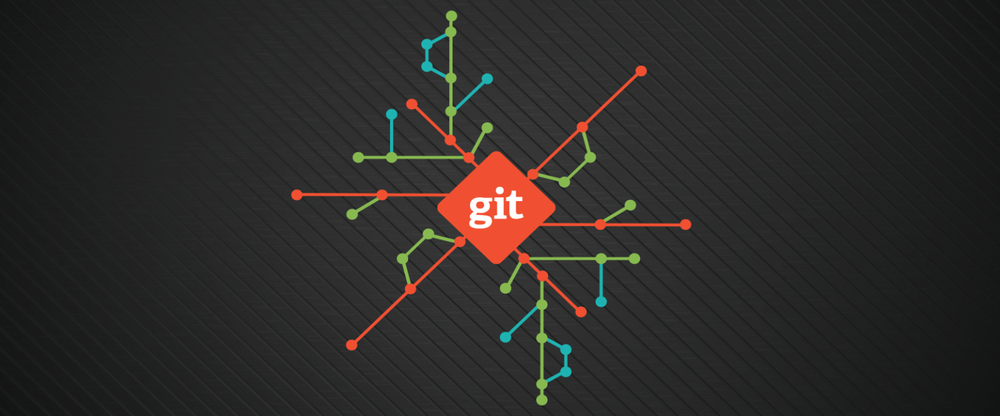
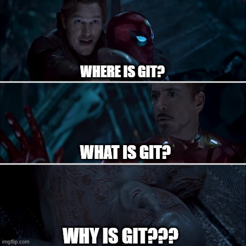
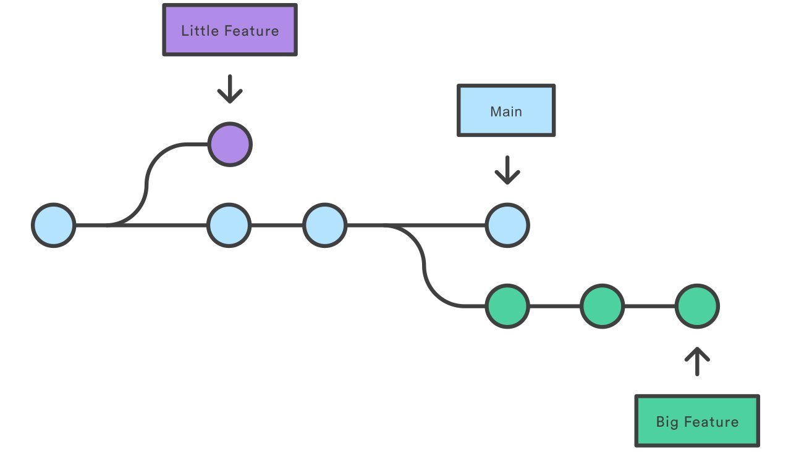
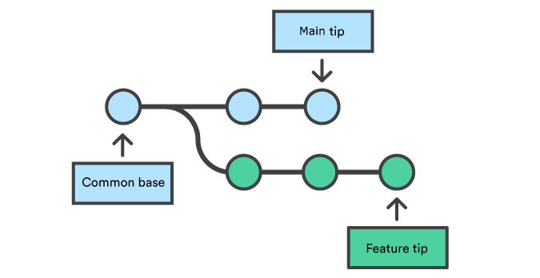
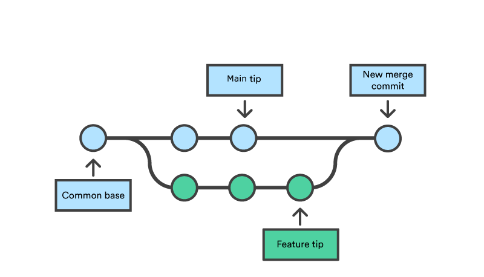
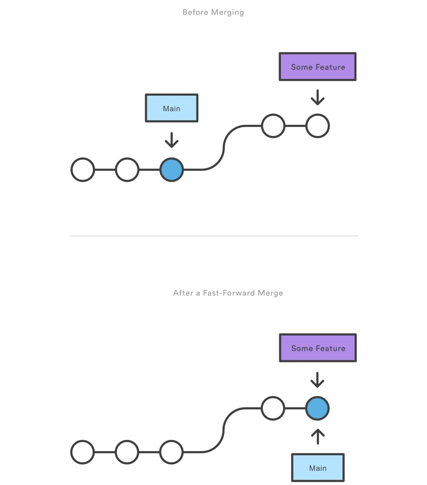
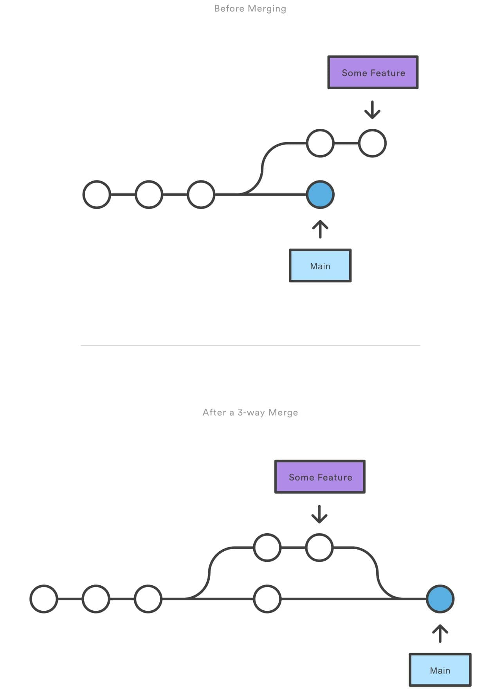
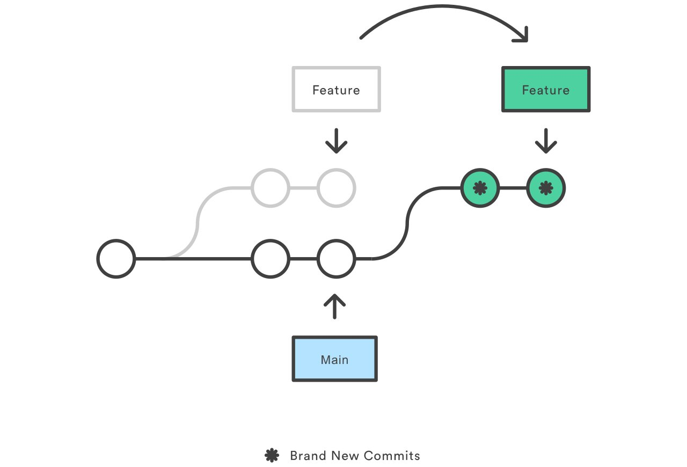
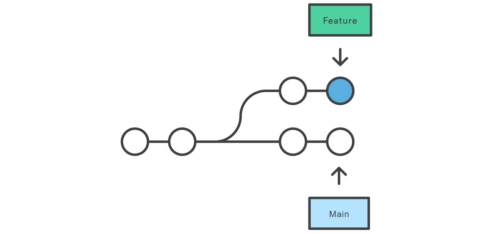
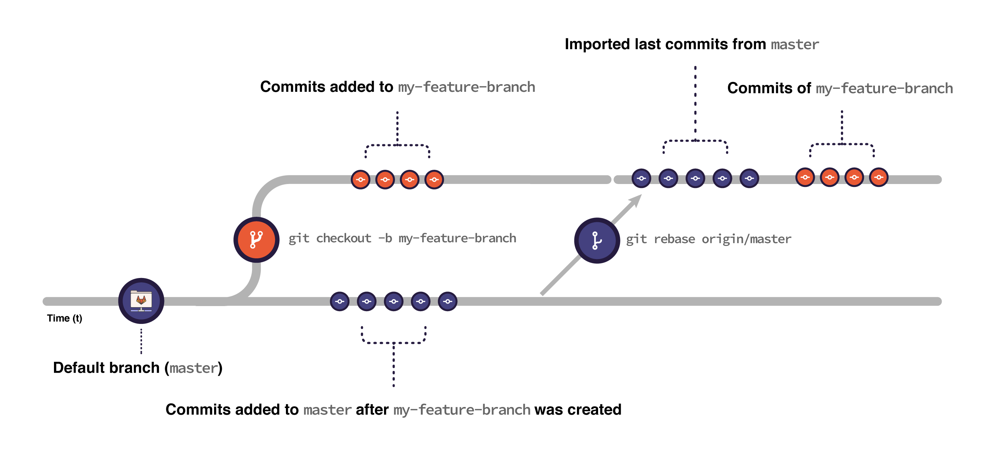

## git --intro




* **Where is Git? What is Git? Why is Git?**
  
  Git is everywhere, at least the concept of it is. Every software development team in any organisation uses it. Heck, even I use this blog on Github pages and use Git to upload a new article. Its a version control system for software applications. It helps you manage versions on code based on the features you implement. So rather than being Tony Stark and using Mark1, Mark2 etc and saving those versions locally you opt for a smart method and use Git (Yes, Tony wasn't as smart as you think 😛). And its collaboration friendly, and the performance is impressive once you know what goes on under the hood.
  

* **Why don't they teach it in school/college?**
  I don't know buddy, they didn't teach taxes either. Probably have to ask the "Curriculum Developers" how a mitochondria can help manage codebase better than Git.😛 
  
* **Is it hard?**
  
  No its not hard. Its seems a little complex, but you get the hang of it. But you need a collaborative environment to understand Git best, which you usually get once you join a organisation. Most freshers (like me) take time to get Git, and that is why I made this guide while I was learning myself.
  

* **What desktop tools does one require for Git?**
  Ideally command line is all one needs. However, there are plenty of Git GUI options available online. Based on your preference, you can search for it and set it up accordingly. 

* **How do I setup Git on my computer?**
  Follow this [link](https://git-scm.com/downloads)

* **What is a git repository?**
  
  Its a directory where you put your codebase. The directory is stored online (on Github/Gitlab or equivalent) and you can have a local copy of it on your computer as well. Every repository contains a ".git" folder which is hidden by default. This folder contains all the git related files and shouldn't be edited manually in most cases. A repository contains your original data files,logs  with messages,author information,other information required to rebuild any version or branch of the project.
  
* **What is meant by forking in software development?**
  A fork is a copy of a repository. Forking a repository allows you to freely experiment with changes without affecting the original project. In pther words, you fork a copy of a repository into another repository and work on it.

## git --objects

At the heart of Git's repository implementation is the object store. Over time, all the information in the object store changes and grows, tracking and modeling your project edits, additions, and deletions. Git places only four types of objects in the object store:


  * **BLOBs** 
    
     Each version of a file is represented as a BLOB. It stands for: “binary large object”, is a term that’s commonly used in computing to refer to some variable or file that can contain any data and whose internal structure is ignored by the program. A blob holds a file’s data but does not contain any metadata about the file or even its name.Git uses blobs to track files, but you should note that a blob stores only the contents of our file, not the name. 
    
  * **Trees** 
    
     A tree object represents one level of directory information. It records blob identifiers, path names, and a bit of metadata for all the files in one directory. It can also recursively reference other sub-tree objects and thus build a complete hierarchy of files and subdirectories.
    
  * **Commits** 
    
     A commit object holds metadata for each CHANGE introduced into the repository, including the author, committer, commit date, and log message. If you see a commit log, you would find the changed lines in each of the code files along with additions and deletions. Each commit points to a tree object that captures, in one complete snapshot, the state of the repository at the time the commit was performed. The initial or first commit, or root commit, has no parent. It is often misconceived
    

  * **Tags**
    
    A tag object assigns an arbitrary yet presumably human readable name to a specific object, usually a commit. Although e25e93e02de231e17abc53aa9ec15d971e refers to an exact and well-defined commit. So, by now you've got that HASH is also an important part of Git.
    

## git --basic_hands_on

Lets get some hands on the basic tasks and terminologies of Git so that we can get started. 

* **How to create a repository?** - There are two methods:
  * Go to the Git Web UI and create a repository. This will create an empty repository directly online.
  * Create a repository locally. You run the following commands:
      ```console
        $ cd /path/to/your/code/base
        $ git init
      ```
     Once you have created it locally. You will still have to add some files and "push" this to the Git server so it gets stored remotely.
   
* **How to clone a remote(online) repository locally?** - Run the command:
```console
  $ git clone username@host:/path/to/repository  
```

* **How to push (upload) a local repository online to a remote server? or How to push changes from local to remote repository?**
  1. You need to create some files (if not present) in the repo directory. If there are some files and you have modified them, proceed to next step.
  2. Stage the changes(locally). Run the command:
      ```console
        $ git add {names of files you want to add in the repository(with file extension)}
      ```
     You can also run:
      ```console
        $ git add . # The . indicates to all newly added/modified files in the local repository folder.
      ```
      Hence, in the second command all newly added/modified files are moved to the staged area.
  3. Commit/confirm the changes (still locally). Run the command :
      ```console
        $ git commit -m "message about the changes"
      ```
     The -m option and the following message is optional but highly recommended. It just takes a few keystrokes but will surely help you and others understand your commit when its a collaborative repository.

  4. Push the changes to remote repository (finally). Run the command:
      ```console
        $ git push
      ``` 
* **How to pull changes from remote repository on (probably older) local?**
    Run the command : 
    ```console
      $ git pull
    ```
  This will bring the local repository upto date with remote. However, if you made some changes on your local, this will ask you to do something with the changes. We will come to this later on.


## git --tale_of_3_trees

So far we have only covered the basics, so you understand the basic know-how and terminologies. To better understand how Git is operating and for the rest of Git stuff to be smooth, we need to look into the metaphor of the three trees. These trees are different collections of files. Each of these trees has a different job: one tree to write changes, one tree to stage them, and one to point to your last commit on a branch in your Git repo. 

For the workflow of adding and retrieving commits, Git uses three different versions of files:

1. **the working directory** -
   
   The working tree is a single checkout of one version of the project. These files are pulled out of the compressed database in the remote Git repository and placed on disk for you to use or modify.
   The working directory represents the actual files on your computer's file system that are available to your code editor to apply changes. The working directory is a version of a particular commit, a particular snapshot of a project that you checked out. It is the version of your Git history that HEAD is pointing at, at any given moment.Files whose contents can be changed are in your working directory. Files placed in your index are getting prepared to be packaged into a commit object. These commits are saved in your Git repository. 
 

2. **the index/staging area** - 
   
   The staging area is a file, generally contained in your Git directory, that stores information about what will go into your next commit. Its technical name in Git parlance is the “index”, but the phrase “staging area” works just as well.

   
   The Git directory a.k.a "HEAD" is where Git stores the metadata and object database for your project. This is the most important part of Git, and it is what is copied when you clone a repository from another computer. HEAD is the part of git that points to your branches. It's a reference, and it has a pretty simple but hugely important job. HEAD points to the currently checked out branch, and that in turn points back to the last commit from that branch.(You must be thinking what is a branch? Just consider your repository main code a tree and figure out what a branch can be. We will discuss this in detail next). HEAD can move not only in time (when you check out previous commits), but it also moves when you create new branches or simply switch to other branches. It's also the point in your Git history that you can place your next commit upon, the parent for your next commit. With every new commit, it replaces its reference to the branch currently checked out—by default, the master branch, of course. So, in effect, HEAD is a reference that frequently changes and points to two things: the branch itself, and through that, the last commit on that branch.

The basic Git workflow goes something like this:

1. You modify files in your working tree.

2. You selectively stage just those changes you want to be part of your next commit, which adds only those changes to the staging area.

3. You do a commit, which takes the files as they are in the staging area and stores that snapshot permanently to your Git directory.

If a particular version of a file is in the Git directory, it’s considered committed. If it has been modified and was added to the staging area, it is staged. And if it was changed since it was checked out but has not been staged, it is modified.

## git --branches

Git branches are effectively a pointer to a snapshot of your codebase, ergo a specific version of it. When you want to add a new feature or fix a bug—no matter how big or how small—you spawn a new branch off your main (or development branch) to encapsulate your changes. This makes it harder for unstable code to get merged into the main code base, and it gives you the chance to clean up your feature's history before merging it into the main branch.



The diagram above visualizes a repository with two isolated lines of development, one for a little feature, and one for a longer-running feature. By developing them in branches, it's not only possible to work on both of them in parallel, but it also keeps the main or **parent** branch free from questionable code.The implementation behind Git branches is much more lightweight than other version control system models. Instead of copying files from directory to directory, Git stores a branch as a reference to a commit. In this sense, a branch represents the tip of a series of commits—it's not a container for commits. The history for a branch is extrapolated through the commit relationships.

A branch represents an independent line of development. It is important to understand that all branches except the main/default branch have a parent; the one from which the branch originated. This concept will be further used in many advanced concepts. Branches serve as an abstraction for the edit/stage/commit process. You can think of them as a way to request a brand new working directory, staging area, and project history. New commits are recorded in the history for the current branch, which results in a fork in the project.

The default branch is "main". The alternative term "master" has been deprecated but is still used in some cases. Hence, "master" or "main" are just the names commonly used for the.... wait for it....... the main branch. But jokes apart, its just a name, you can name it "full_cake" as well (if your branches are "pastries" 😛). Just create a branch and set it as default branch using the Git web UI or set the default main branch in your local git settings :
  ```console
    $ git branch -m <current_default> <new_default> # for renaming the default/main branch for the current repository
    $ git push
  ```
  You can also change the global setting for default branch names when you initialise a new repository.
  ```console
    $ git config --global init.defaultBranch <custom_default_branch> # this will set default branch name to the custom name you set
  ```

Just like the branch name “master” does not have any special meaning in Git, neither does “origin”. While “master” is the default name for a starting branch when you run git init which is the only reason it’s widely used, “origin” is the default name for a remote when you run git clone. If you run git clone -o booyah instead, then you will have booyah/master as your default remote branch. In other words, "origin" is a name for the remote git domain name. (yes, git has many flavours apart from github)
You can check and change the remote repo name using the following commands: 
```console
  $ git remote -v # check the current remote name
  $ git remote rename <current_remote_name> <new_remote_name> # rename the remote repo
```

* **How to work with branches?**
  1. Creating a local branch from current branch -
      ```console
        $ git checkout -b <new_branch>
      ```
  2. Creating a local branch from a specific branch -
      ```console
        $ git checkout -b <new-branch> <from-branch-name>
      ```
  3. Pushing the branch to remote repository -
      ```console
        $ git push origin <new_branch>
      ```
  4. Deleting a remote branch - 
      ```console
        $ git push origin --delete <my-branch-name>
      ```
  5. Deleting a local branch, run either of these commands- 
      ```console
        $ git branch -d <my-branch-name>
      ``` 
    OR
      ```console  
        $ git branch -D <my-branch-name>
      ``` 
  6. Switch an already present branch - 
      ```console
        $ git pull # if the branch is remote,else can skip this
        $ git checkout <my-branch_name>
      ```
  7. List Branches - 
      ```console
        $ git branch # local branches
        $ git branch -r # remote branches
        $ git branch -a # all local and remote branches
      ```

## git --merge

Merging is Git's way of putting a forked history back together again. The git merge command lets you take the independent lines of development created by git branch and integrate them into a single branch.Note that all of the commands presented below merge into the current branch. The current branch will be updated to reflect the merge, but the target branch will be completely unaffected.Git merge will combine multiple sequences of commits into one unified history. In the most frequent use cases, git merge is used to combine two branches. In most common scenarios, git merge takes two commit pointers, usually the branch tips, and will find a common base commit between them. Once Git finds a common base commit it will create a new "merge commit" that combines the changes of each queued merge commit sequence.

Say we have a new branch feature that is based off the main branch. We now want to merge this feature branch into main.



Invoking this command will merge the specified branch feature into the current branch, we'll assume main. Git will determine the merge algorithm automatically (discussed below).



Merge commits are unique against other commits in the fact that they have two parent commits. When creating a merge commit Git will attempt to auto magically merge the separate histories for you. If Git encounters a piece of data that is changed in both histories it will be unable to automatically combine them. This scenario is a merge conflict and Git will need user intervention to continue.


**What are the general steps to merge branches smoothly?**

* **Confirm the receiving branch**
  
    Execute git status to ensure that HEAD is pointing to the correct merge-receiving branch. If needed, execute git checkout to switch to the receiving branch. In our case we will execute git checkout main.

* **Fetch latest remote commits**
  
    Make sure the receiving branch and the merging branch are up-to-date with the latest remote changes. Execute git fetch to pull the latest remote commits. Once the fetch is completed ensure the main branch has the latest updates by executing git pull.

* **Merging**
  
  Once the previously discussed "preparing to merge" steps have been taken a merge can be initiated by executing git merge where  is the name of the branch that will be merged into the receiving branch.

* **Fast Forward Merge**
  
  A fast-forward merge can occur when there is a linear path from the current branch tip to the target branch. Instead of “actually” merging the branches, all Git has to do to integrate the histories is move (i.e., “fast forward”) the current branch tip up to the target branch tip. This effectively combines the histories, since all of the commits reachable from the target branch are now available through the current one. For example, a fast forward merge of some-feature into main would look something like the following:



However, a fast-forward merge is not possible if the branches have diverged. When there is not a linear path to the target branch, Git has no choice but to combine them via a 3-way merge. 3-way merges use a dedicated commit to tie together the two histories. The nomenclature comes from the fact that Git uses three commits to generate the merge commit: the two branch tips and their common ancestor.



While you can use either of these merge strategies, many developers like to use fast-forward merges (facilitated through rebasing) for small features or bug fixes, while reserving 3-way merges for the integration of longer-running features. In the latter case, the resulting merge commit serves as a symbolic joining of the two branches.


**Resolving Merge conflict**

If the two branches you're trying to merge both changed the same part of the same file, Git won't be able to figure out which version to use. When such a situation occurs, it stops right before the merge commit so that you can resolve the conflicts manually. The great part of Git's merging process is that it uses the familiar edit/stage/commit workflow to resolve merge conflicts. When you encounter a merge conflict, running the git status command shows you which files need to be resolved. Most code editors or IDEs will also show the conflicts and even offer many intuitive GUI tools for you to resolve the conflicts in the codebase. Once you have resolved all conflicts manually, you need to push the merge to the remote repository because so far everything done is in your local branch. The merge commit needs to be pushed just like any other commit.


## git --rebase

Rebase is one of two Git utilities that specializes in integrating changes from one branch onto another. The other change integration utility is git merge, which we just discussed. Merge is always a forward moving change record. Alternatively, rebase has powerful history rewriting features. Rebase itself has 2 main modes: "manual" and "interactive" mode. It is a common way to integrate upstream changes into your local repository. Pulling in upstream changes with Git merge results in a superfluous merge commit every time you want to see how the project has progressed. On the other hand, rebasing is like saying, “I want to base my changes on what everybody has already done.” 

Rebasing is the process of moving or combining a sequence of commits to a new base commit. Rebasing is most useful and easily visualized in the context of a feature branching workflow. The general process can be visualized as the following:




From a content perspective, rebasing is changing the base of your branch from one commit to another making it appear as if you'd created your branch from a different commit. Internally, Git accomplishes this by creating new commits and applying them to the specified base. It's very important to understand that even though the branch looks the same, it's composed of entirely new commits.

The primary reason for rebasing is to maintain a linear project history. For example, consider a situation where the main branch has progressed since you started working on a feature branch. You want to get the latest updates to the main branch in your feature branch, but you want to keep your branch's history clean so it appears as if you've been working off the latest main branch. This gives the later benefit of a clean merge of your feature branch back into the main branch. Why do we want to maintain a "clean history"? The benefits of having a clean history become tangible when performing Git operations to investigate the introduction of a regression. You have two options for integrating your feature into the main branch: merging directly or rebasing and then merging. The former option results in a 3-way merge and a merge commit, while the latter results in a fast-forward merge and a perfectly linear history. The following diagram demonstrates how rebasing onto the main branch facilitates a fast-forward merge.



It is important to note that git rebase rewrites the commit history. It can be harmful to do it in shared branches. It can cause complex and hard to resolve merge conflicts. In these cases, instead of rebasing your branch against the default branch, consider pulling it instead (git pull origin master). It has a similar effect without compromising the work of your contributors.

**How to rebase?**

**Before rebasing**

It’s safer to back up your branch before rebasing to make sure you don’t lose any changes. For example, consider a feature branch called my-feature-branch:

 1. Open your feature branch in the terminal:
    ```console
      $ git checkout my-feature-branch
    ```
 2. Checkout a new branch from it:
    ```console
      $ git checkout -b my-feature-branch-backup
    ```
 3. Go back to your original branch:
    ```console
      $ git checkout my-feature-branch
    ```
Now you can safely rebase it. If anything goes wrong, you can recover your changes by resetting my-feature-branch against my-feature-branch-backup using the following command:
    ```console
      $ git reset --hard my-feature-branch-backup
    ```
Note that if you added changes to my-feature-branch after creating the backup branch, you lose them when resetting.

* **Regular rebase**



With a regular rebase you can update your feature branch with the default branch (or any other branch). This is an important step for Git-based development strategies. You can ensure that the changes you’re adding to the codebase do not break any existing changes added to the target branch after you created your feature branch.

For example, to update your branch my-feature-branch with your default branch (here, using main):

1. Fetch the latest changes from main:
    ```console
    $ git fetch origin main
    ```
2. Checkout your feature branch:
    ```console
    $ git checkout my-feature-branch
    ```
3. Rebase it against main:
    ```console
    $ git rebase origin/main
    ```
4. Force-push to your branch.(When you perform more complex operations, for example, squash commits, reset or rebase your branch, you must force an update to the remote branch. These operations imply rewriting the commit history of the branch. To force an update, pass the flag --force or -f to the push command. )
   ```console
    $ git push --force origin my-feature-branch
   ```

**Git merge vs Git rebase**

* Merge takes all the changes in one branch and merges them into another branch in one commit.Let's say you have created a branch for the purpose of developing a single feature. When you want to bring those changes back to master, you probably want merge (you don't care about maintaining all of the interim commits).
 
* Rebase says I want the point at which I branched to move to a new starting point. If you started doing some development and then another developer made an unrelated change. You probably want to pull and then rebase to base your changes from the current version from the repository.
  
## git --org_workflows
Every organisation uses a specific workflow when managing codebase using any flavour of Git. A Git workflow is like a bureaucratic system where the members of the repository have different roles on different branches, just like any federal government. Since its not exactly a Git technique, I won't be covering it in this guide. You can have a look at common git workflows at this [link](https://zepel.io/blog/5-git-workflows-to-improve-development/)


## git --miscellaneous
I have not covered all git commands and their various options as you can always refer to a [cheatsheet](https://education.github.com/git-cheat-sheet-education.pdf) for that. Based on the scenarios you may face, you can figure out options now that you understand how Git works and all the major methods. Here are a few more commands that are useful on a regular basis:

1. **Status** -
   ```console
    $ git status
   ```
   List which files are staged, unstaged, and untracked.

2. **Fetch** -
   ```console
    $ git fetch
   ```
   The git fetch command downloads commits, files, and refs from a remote repository into your local repo. Fetching is what you do when you want to see what everybody else has been working on. Git isolates fetched content from existing local content; it has absolutely no effect on your local development work. Fetched content has to be explicitly checked out using the git checkout command. This makes fetching a safe way to review commits before integrating them with your local repository.
   
   When downloading content from a remote repo, git pull and git fetch commands are available to accomplish the task. You can consider git fetch the 'safe' version of the two commands. It will download the remote content but not update your local repo's working state, leaving your current work intact. git pull is the more aggressive alternative; it will download the remote content for the active local branch and immediately execute git merge to create a merge commit for the new remote content. If you have pending changes in progress this will cause conflicts and kick-off the merge conflict resolution flow.

3. **Log** - 
   ```console
    $ git log
   ```
   Display the entire commit history using the default format.

4. **Diff** - 
   ```console
    $ git diff
   ```
  Show unstaged changes between your index and working directory.

Feel free to let me know in the comments below or reach out to me on the platforms(links on the left) to discuss Git. I am giving credits to the resources I used to create this guide in the links below.

References : [Medium](https://pamodaaw.medium.com/a-simple-guide-to-starting-with-git-516f41a696f2),[Tutsplus](https://code.tutsplus.com/tutorials/what-are-the-three-trees-in-git--cms-28188),[Git-scm](https://git-scm.com/),[Atlassian](https://www.atlassian.com/git/tutorials),[Gitlab Docs](https://docs.gitlab.com/)

Image Credit: [SoftChief](https://softchief.com/),[ImgFlip](https://softchief.com/),[Atlassian](https://www.atlassian.com/git/tutorials)

