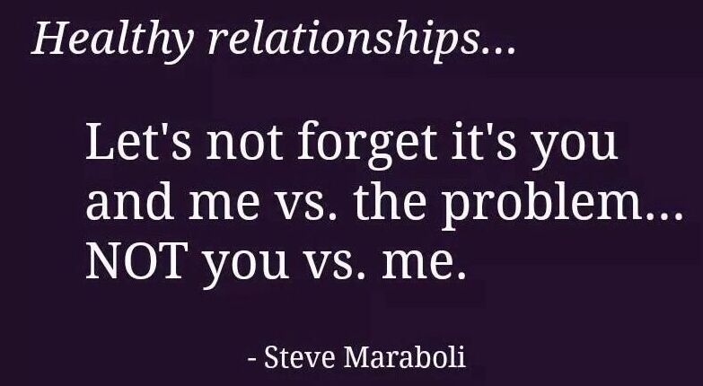

The above quote might seem so simple and many of might already make out what I am about to talk about. Enough intro, lets talk.

## The context; the big picture

Consider a 100% pure and calm lake. Now a small contaminated water drop drops into this lake and causes ripples in the lake. The lake became disturbed for a while, before being calm again. But now it has some impurity in it. The essence isn't the same anymore. Suddenly, someone feeds this lake more and more such drops, thereby causing a regular disturbance ripple and increased amount of contamination. Now in this, replace the lake with your relationship and the dirty water drop with misunderstandings or heated fights with personal attacks.

Over the years, we have seen the increased number of nuclear families, short marriages, broken blood relationships and lack of good friendships. More often than not, especially in case of loved ones, it is miscommunication and improper handling of disagreements that leads to this unfortunate consequence. A small misunderstanding causes a heated debate which eventually leads to bitterness in the relationship, in most cases. You know what is the worst? When the personal attacks start popping out of angered emotions.This is the lowest point. Once you start attacking each other personally, I would say all objectivity is lost, and you are ultimately nowhere forward. Sounds familiar? Happens to almost all of us I believe.

## What usually happens; the smaller picture

Whenever you and your close one are faced with a disagreement ,a conflict, or a circumstance created problem, the EGO enters the arena. Sad but true. You have one thing in mind and the other has the polar opposite of it. What happens next? You both start argueing on why you are right, ultimately losing the real perspective and the problem behind. It becomes a UN level debate wtih him/her even though both of you want (world) peace. Pun intended. You feel you are right.Interjection to your opinion sparks heated conversation. And trust me, the conversation isn't lit. 

(I know you must be thinking, does this guy have a point or just has a bunch of bad puns put together? I guess I really can't help myself at times.\*\*Chuckles on the puns\*\*)
{:.faded}

A very common thing that I have noticed is that interrelationship problems originate from small and often, stupid misunderstandings. Small instances that occur or misinterpretation of what one said to the other is something all of us can relate to. Infact, a bad mood completely alters our viewpoint, makes us feel cynical about everything. Suddenly everyone around us is just straight up bad. These misunderstandings are the cause for negative bias towards the other if not handled delicately. Our mood affects how we interpret and react to something. End result? You are angry at your loved one, probably without good cause. Your consequent actions and words impacted by the latter most probably leads to a fight. Now both of you are in angered and rather confused emotional state. For most of us, the ego dominates. The arguement brews. You are now versus each other. Now take a breather. Wouldn't it be better if it was both of you vs the problem? Facing the problem together? #Foodforthought

## So how do we properly handle this?

You might be saying that easier said than done. How do we actually practice this? 
We are built in a way that it is almost natural for us to engage all defenses when we as an individual are told we aren't right. Its the rejection reaction if I may say so. It is a very mature and probably difficult thing to do to actually acknowledge the opposite perspective and addressing it as viable or maybe correct a step further. Long story short, the meaning of "Us vs the Problem" rather than "You vs Me" is to realise that you are not facing this issue as an individual, but together. As one. In times of adversity,we forget such simple things hence this becomes easier said than done. You remove your individuality since this is not only yours to handle, use the trust that you and your loved one have built. Focus on the problem rather than proving yourself right and winning the arguement. Infact, it shouldn't even be an arguement. Yes, clashes or differences of opinion don't have to be arguements or debates. Normalise conflict resolution through DISCUSSION rather than debating the motion as to who is right. 

## End notes

See the beauty of this discussion approach if I may call it so, is that its all in your control. Life rarely gives that, if I am being really honest. Your perspective, your attitude, your way of talking, its all YOU.To build this perspective takes time and patience. It also requires the cooperation of your partner or loved one. Speaking in a more practical manner, for every kind of problem in relationships, you can do this. Your approach towards the conflict needs to be in a way you are addressing the problem, not fighting your solution on how to deal with it. You have to throw the dominating ego aside, DISCUSS the issue even though it may affect you more directly. Discussing instead of complaining or debating is the way I like to see it. 

One question that you may have is that what if the other person doesn't react similiarly? Well feel free to express this to them as a seperate discussion if you share such an understanding on things. After all, trying is life, isn't it? 

(Or is life trying? I say depends on your day. #AnotherFoodforthought)
{:.faded}

The most joyous consequence of this is that your relationship comes out stronger than before. You overcome issues by teamwork, which strengthens the bond. So basically what you just did is you played an UNO Reverse card on the adverse situation. In trying times that test your relationship, you come out even better. I would even say that, winning an arguement is almost kiddish. And from personal experience, the satisfaction and joy of striding forward together makes you feel elated at a completely other level.  After all, I think, what is love, if not teamwork persevering?
